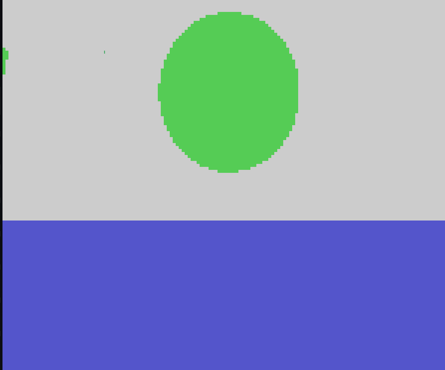
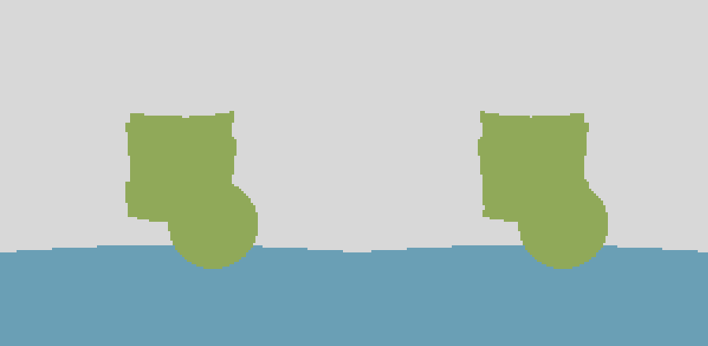

# Naive raytracing demo using terminal graphics

This project renders a 3d world inside the terminal using ANSI (Truecolor).

Implementation based on this wikipedia article: https://en.wikipedia.org/wiki/Ray_tracing_(graphics)

Tested in Wezterm and Alacritty

## Building


```bash
git clone https://github.com/baroxyton/raytracing-cpp &&
cd raytracing-cpp &&
make
```

## Rotating camera frame demo



## Side-By-Side 3D demo



the resulting image can be viewed with depth perception using eye-crossing, or SBS VR glasses
